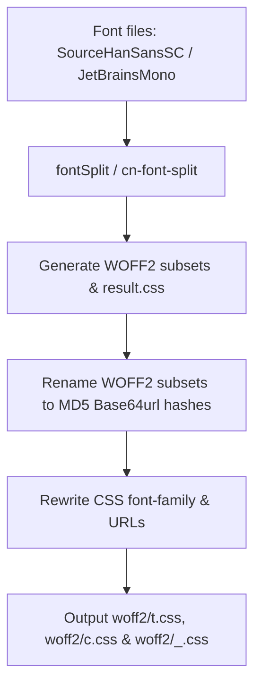

# 18s : Chinese font subsetting packages for the WebC component library

WebC is a Web Components library designed for AI-assisted development. This package provides Chinese font subsetting support for WebC.

Online Preview: [https://webc-zh.pages.dev](https://webc-zh.pages.dev)

* [Features](#features)
* [Directory Structure](#directory-structure)
* [Design & Process](#design--process)
* [Tech Stack](#tech-stack)
* [Usage](#usage)
* [History & Background](#history--background)

## Features

- **Chinese Font Subsetting**: Splits Chinese fonts (CJK) into WOFF2 chunks (128KB) to reduce loading times.
- **Cache Busting**: Uses MD5 hashes of chunk content as filenames to prevent collision and improve caching.
- **Variable & Math Font Support**: Includes Source Han Sans SC (`t`) and JetBrains Mono (`c`) variable font subsets, and supports publishing the math font `m` (Latin Modern Math) without subsetting (automatically compressed from `otf/latinmodern-math.otf`).
- **CSS**: Outputs minimized CSS containing `@font-face` rules mapping character ranges to chunks or mapping weights/styles to math font.

## Directory Structure

```
.
├── gen/                 # Generation workspace containing raw TTF/OTF files and processing scripts
│   ├── lib/             # Processing modules (font splitting, hash resolution, CSS minification)
│   ├── ttf/             # Source TrueType Font (.ttf) files and configurations
│   ├── gen.js           # Subsetting execution script
│   ├── m.js             # Math font processing script (no subsetting)
│   └── gen.sh           # Setup and FFI dependencies download script
├── woff2/               # Output distribution directory containing published assets
│   ├── *.woff2          # Content-addressed subset/full font chunks
│   ├── t.css            # Source Han Sans SC Font-face mappings
│   ├── c.css            # JetBrains Mono Font-face mappings
│   ├── m.css            # Math font m mappings
│   └── _.css            # Merged Font-face mappings for all fonts (including t, c, and math font m)
├── readme/              # Project documentation
│   ├── en.md            # English README
│   └── zh.md            # Chinese README
├── package.json         # Project configuration metadata
└── README.mdt           # Compilation template for root README
```

## Design & Process

The compiler processes fonts defined in `gen/ttf/gen.yml`, splitting them and preparing CSS and font chunks.



1. **Splitting**: Fonts are subsetted using `cn-font-split` into WOFF2 chunks.
2. **Hashing**: Each chunk is renamed to its MD5 base64url hash (starting at length 4, expanding on conflict).
3. **Rewriting**: CSS is parsed to replace font-family names with aliases (`t` and `c`), omit local paths, and update chunk URLs.
4. **Publishing**: CSS and WOFF2 chunks are output to `woff2/` for npm publication.

## Tech Stack

- **Runtime**: Bun
- **Font Splitter**: `cn-font-split`
- **CSS Minifier**: `lightningcss`
- **Hash Function**: `@3-/base64url`

## Usage

### Installation

```bash
npm install 18s
```

### Importing Fonts

Import the required CSS file in web components or application entries:

```javascript
// Import all fonts at once (merged CSS, including t, c, and math font m)
import '18s/_.css';

// Or import individual fonts as needed
// Import Source Han Sans SC
import '18s/t.css';

// Import JetBrains Mono
import '18s/c.css';

// Import math font m
import '18s/m.css';
```

Apply in CSS stylesheets:

```css
body {
  font-family: t, sans-serif;
}

code {
  font-family: c, t, monospace;
}

math {
  font-family: m, t, sans-serif;
}
```

### Publishing Math Font

1. The source font file is located at `otf/latinmodern-math.otf` in the project root.
2. Run `./gen.sh` in the `gen/` directory. The build system will compress this font file into WOFF2 format under `woff2/` (using content-addressed hashing) and generate `woff2/m.css` mapped to font family `m`.

## History & Background

CJK font files are large (10MB to 50MB) as they contain tens of thousands of glyphs. Loading them in browsers causes rendering latency. Previously, developers embedded static character subsets or relied on system defaults, limiting design options.

Source Han Sans, introduced by Adobe and Google in 2014, solved CJK typeface quality issues but still had large file sizes. Font splitters like `cn-font-split` split these typefaces into chunks based on character frequency. Browsers fetch chunks containing characters present on the page, improving performance.

JetBrains Mono, released in 2020, is designed for readability. Project `18s` bundles these typefaces as variable fonts to provide Chinese font support for WebC.

### Latin Modern Math

**Latin Modern Math** is an OpenType mathematical font designed to serve as a modern companion to the Latin Modern family of typefaces, completing the modernization of Donald Knuth's classic Computer Modern typeface. It includes a comprehensive set of mathematical and technical characters and supports advanced layout features required for complex mathematical typesetting (using the OpenType `MATH` table). It is widely used in LaTeX and other modern typesetting systems to render mathematical equations.
