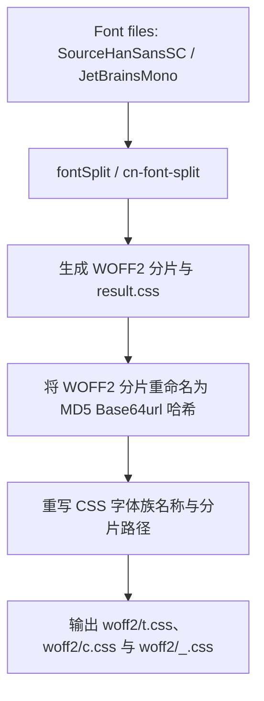

# 18s : WebC 组件库中文字体分片包

WebC 是面向 AI 辅助开发的 Web Components 组件库。本包为 WebC 提供中文字体分片支持。

组件库在线浏览地址：[https://webc-zh.pages.dev](https://webc-zh.pages.dev)

* [功能特性](#功能特性)
* [目录结构](#目录结构)
* [设计思路与调用流程](#设计思路与调用流程)
* [技术堆栈](#技术堆栈)
* [使用指南](#使用指南)
* [历史背景](#历史背景)

## 功能特性

- **中文字体分片**：将中文字体（CJK）切分为 WOFF2 分片（默认 128KB），降低加载时延。
- **防止冲突**：基于分片内容生成 MD5 哈希作为文件名，解决缓存冲突并提升缓存命中率。
- **可变字重与多字重支持**：提供思源黑体（`t`）与 JetBrains Mono（`c`）可变字重分片版本，同时支持发布免切片的数学字体 `m`（由 `otf/latinmodern-math.otf` 自动压缩生成）。
- **CSS**：输出压缩的 CSS 代码，内置 `@font-face` 规则，映射字符区间至对应字体分片或映射多字重字体。

## 目录结构

```
.
├── gen/                 # 字体构建工作区，包含原始 TTF/OTF 文件与处理脚本
│   ├── lib/             # 分片处理、哈希寻址与 CSS 压缩模块
│   ├── ttf/             # 原始字体文件及配置
│   ├── gen.js           # 字体分片执行脚本
│   ├── m.js             # 数学字体处理脚本（无分片）
│   └── gen.sh           # 依赖拉取与构建脚本
├── woff2/               # 编译分发目录，包含最终发布资源
│   ├── *.woff2          # 内容寻址的 WOFF2 字体分片/整包
│   ├── t.css            # 思源黑体字体映射表
│   ├── c.css            # JetBrains Mono 字体映射表
│   ├── m.css            # 数学字体 m 的映射表
│   └── _.css            # 合并所有字体的映射表（包含 t、c 与数学字体 m）
├── readme/              # 文档目录
│   ├── en.md            # 英文文档
│   └── zh.md            # 中文文档
├── package.json         # 项目元数据配置
└── README.mdt           # 主 README 模板文件
```

## 设计思路与调用流程

构建系统读取 `gen/ttf/gen.yml` 配置，处理字体并生成发布资源。



1. **分片处理**：调用 `cn-font-split` 工具，将字体切分为 WOFF2 片段。
2. **哈希映射**：计算分片内容的 MD5 base64url 哈希作为文件名（长度从 4 开始，遇冲突时递增），实现内容寻址。
3. **样式重写**：解析 CSS，将 font-family 替换为别名（`t` 或 `c`），移除本地路径（`local`）查询，更新字体分片 URL 引用。
4. **资源输出**：将 CSS 及字体分片写入发布目录 `woff2/`，进行 npm 发布。

## 技术堆栈

- **运行环境**：Bun
- **分片工具**：`cn-font-split`
- **样式压缩**：`lightningcss`
- **哈希算法**：`@3-/base64url`

## 使用指南

### 安装依赖

```bash
npm install 18s
```

### 导入字体

在 Web 组件或应用入口中引入 CSS 文件：

```javascript
// 一次性引入所有字体（合并后的 CSS，包含 t、c 与数学字体 m）
import '18s/_.css';

// 或者按需引入单个字体
// 引入思源黑体
import '18s/t.css';

// 引入 JetBrains Mono
import '18s/c.css';

// 引入数学字体 m
import '18s/m.css';
```

在样式表中应用对应的字体族：

```css
body {
  font-family: t, sans-serif;
}

code {
  font-family: c, t, monospace;
}

math {
  font-family: m, t, sans-serif;
}
```

### 发布数学字体

1. 字体源文件为项目根目录下的 `otf/latinmodern-math.otf`。
2. 在 `gen/` 目录运行构建命令 `./gen.sh`，构建系统会自动将其压缩为 WOFF2 并保存到 `woff2/` 下（通过内容寻址哈希命名），同时生成映射到字体族 `m` 的 `woff2/m.css`。

## 历史背景

CJK 字体由于文件大（10MB 至 50MB），直接加载会导致白屏或字体闪烁。以往开发多采用系统默认字体，或通过静态抽字工具仅保留部分字词，限制了动态内容展示。

2014 年，Adobe 与 Google 推出 CJK 字体思源黑体（Source Han Sans），但体积问题依旧存在。随着分片技术（如 `cn-font-split`）出现，字体文件能按字符使用频率切分为数百个分片。浏览器按需下载分片，优化了中文字体加载体验。

JetBrains Mono 是 2020 年发布的编程字体。`18s` 将思源黑体与 JetBrains Mono 作为可变字体整合分片，为 WebC 提供中文字体支持。

### Latin Modern Math 数学字体

**Latin Modern Math** 是一款 OpenType 格式的数学字体，旨在作为 Latin Modern 字体家族的现代伴侣，完成了对高德纳（Donald Knuth）经典 Computer Modern 字体的现代化重构。该字体包含了丰富的数学和技术符号，并支持高级 OpenType 数学排版特性（支持 `MATH` 表），广泛应用于 LaTeX 及其他现代排版系统中，以提供高质量、规范的数学公式渲染效果。
